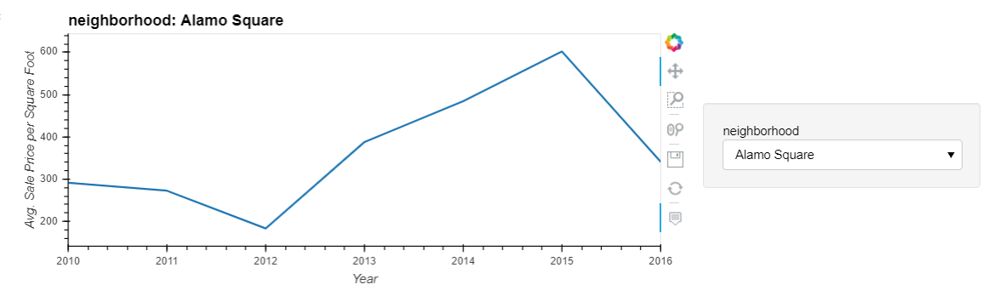

# PyViz_Dashboard San Francisco Real Estate

*[San Francisco Park Reading by Juan Salamanca](https://www.pexels.com/photo/park-san-francisco-reading-61109/) | [Free License](https://www.pexels.com/photo-license/)*

## Background

The goal of this dashboard is to provide charts, maps, and interactive visualizations that help customers explore the data and determine if they want to invest in rental properties in San Francisco. We will do so by completing the following tasks:

1. [Complete a notebook of rental analysis](#Rental-Analysis).

2. [Create a dashboard of interactive visualizations to explore the market data](#Dashboard).

---

## Files

* [sfo_neighborhoods_census_data.csv](Starter_Code/Data/sfo_neighborhoods_census_data.csv)
* [neighborhoods_coordinates.csv](Starter_Code/Data/neighborhoods_coordinates.csv)
* [Rental Analysis Starter Jupyter Notebook](Starter_Code/rental_analysis.ipynb)
* [Dashboard Starter Jupyter Notebook](Starter_Code/dashboard.ipynb)

## Instructions

### Rental Analysis

The first step to building the dashboard is to work out all of the calculations and visualizations in an analysis notebook. Once the code is worked out here, it can be copied over to a dashboard code and used with Panel to create the final layout. 

#### Housing Units Per Year

Calculate the number of housing units per year and visualize the results as a bar chart using the Pandas plot function.

Default Bar Chart

  

Bar Chart with y-axis limits adjusted

  

#### Average Housing Costs in San Francisco Per Year

Determine the average sales price per year and the average gross rent per year to better understand housing costs over time.

1. Calculate the mean `gross_rent` and `sale_price_sqr_foot` for each year.
2. Visualize the mean `gross_rent` and `sale_price_sqr_foot` for each year as two line charts.

  

  

#### Average Prices By Neighborhood

Use hvplot to create two interactive visulizations of average prices with a dropdown selector for the neighborhood. The first visualization will be a line plot showing the trend of average price per square foot over time for each neighborhood.  The second will be a line plot showing the trend of average montly rent over time for each neighborhood.

  
  
  

#### Top 10 Most Expensive Neighborhoods

Calculate the mean sale price for each neighborhood and then sort the values to obtain the top 10 most expensive neighborhoods on average. Plot the results as a bar chart.

  

#### Comparing Cost to Purchase Versus Rental Income

Use `hvplot` to create an interactive visualization with a dropdown selector for the neighborhood. This visualization will feature a side-by-side comparison of average price per square foot versus average monthly rent by year.

#### Neighborhood Map

Read in neighborhood location data and build an interactive map with the average prices per neighborhood. Use a scatter mapbox object from plotly express to create the visualization. 

  

####  Cost Analysis 

Use plotly express to create a Parallel Coordinates plot, Parallel Categories plot, and a Sunburst plot so that investors can interactively filter and explore various factors related to the sales price of the neighborhoods. Using the provided DataFrame to create the following visualizations:

1. Parallel Coordinates Plot.

  

2. Parallel Categories Plot.

  

3. Sunburst plot to show the most expensive neighborhoods in San Francisco per year.

    
 
---

### Dashboard

Final Output

  

---
